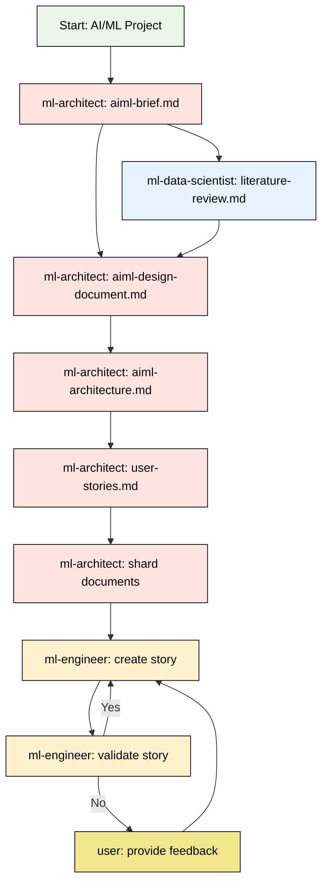

# BMAD AI/ML Engineering Expansion Pack (v2.0)

This expansion pack extends the BMAD Method framework to support AI/ML engineering projects. It provides agents, workflows, templates, and best practices in a consolidated architecture.

## Project History

**Founder**: Laurence Liew ([@beowulf68](https://github.com/beowulf68)) - Developed the initial workflows and agent framework. His contributions established the core methodology and approach.

**Current Maintainers**: 
- **Najib Ninaba** ([@najibninaba](https://github.com/najibninaba)) - Core Team Member
- **Siavash Sakhavi** ([@ssakhavi](https://github.com/ssakhavi)) - Core Team Member

## Project Timelines

BMAD frameworks support different project timelines:
- **Traditional Timeline**: 6-12 months
- **BMAD Timeline**: 3-12 weeks
- **Iteration Speed**: Prototyping and testing cycles
- **Deployment Frequency**: Multiple deployments per day

## Overview

The streamlined AI/ML Engineering expansion pack provides specialized agents, workflows, templates, and best practices for:

- Machine Learning model development and deployment
- Large Language Model (LLM) and RAG application development
- Comprehensive MLOps pipeline implementation
- Unified AI security, ethics, and governance
- Data science and analytics workflows
- AI Singapore program-specific workflows

## Installation

### Prerequisites

Your target project must be BMAD-enabled with instructions from [BMAD-METHOD](https://github.com/bmad-code-org/BMAD-METHOD).

### 1. Clone This Repository

```bash
# Clone the expansion pack
git clone https://github.com/aisingapore/bmad-aisg-aiml.git
cd bmad-aisg-aiml
```

### 2. Install the [BMAD Pack Installer](https://github.com/najibninaba/bmad-pack-installer) via `uv`

```bash
# Install once (recommended for regular use)
uv tool install bmad-pack-installer

# Or run directly without installation
uvx --from bmad-pack-installer bmad-pack-installer deploy . /path/to/project
```

### 3. Deploy This Pack

```bash
# Basic installation (from cloned repo directory)
bmad-pack-installer deploy . /path/to/project

# Preview changes without installing
bmad-pack-installer deploy . /path/to/project --dry-run

# Force reinstall over existing pack
bmad-pack-installer deploy . /path/to/project --force
```

### Validation

```bash
# Check if target is valid BMAD project
bmad-pack-installer check /path/to/project

# Validate this expansion pack (from cloned repo directory)
bmad-pack-installer validate .
```

The installer creates:
- Hidden directory: `.bmad-aisg-aiml/`
- Claude commands: `.claude/commands/bmadAISG/`
- Updated manifests and symbolic links

## Usage

### Follow the Workflow

1. **Check workflows folder** for workflow files:
   ```bash
   # Navigate to installed workflows
   cd .bmad-aisg-aiml/workflows/
   ls
   ```

2. **For Claude Code implementation**: Run the agents and tasks manually using `/{agent-name}` command.

## Core Agent Team

### 5 Agents

1. **Marcus Tan Wei Ming** - ML/AI Engineer & MLOps Specialist (`ml-engineer`)
   - **Heritage**: Singaporean Chinese
   - **Expertise**: End-to-end ML development, MLOps pipelines, infrastructure automation
   - **Technical Skills**: PyTorch/TensorFlow, Kubernetes/Docker, CI/CD, cloud platforms
   - **Focus Areas**: Model training, deployment, monitoring, production systems

2. **Rizwan bin Abdullah** - ML/AI System Architect (`ml-architect`)
   - **Heritage**: Singaporean Malay
   - **Expertise**: ML system design, scalable architectures, infrastructure planning
   - **Technical Skills**: Distributed systems, transformer architectures, RAG systems
   - **Focus Areas**: System design, model architecture selection, technical strategy

3. **Sophia D'Cruz** - Senior Data Scientist (`ml-data-scientist`)
   - **Heritage**: Singaporean Eurasian
   - **Expertise**: Statistical analysis, experimental design, recommendation systems
   - **Technical Skills**: Causal inference, A/B testing, feature engineering
   - **Focus Areas**: EDA, hypothesis testing, insights generation, model evaluation

4. **Priya Sharma** - ML Security & Ethics Specialist (`ml-security-ethics-specialist`)
   - **Heritage**: Singaporean Indian
   - **Expertise**: ML security, adversarial testing, AI ethics, compliance
   - **Technical Skills**: Red teaming, bias detection, privacy protection
   - **Focus Areas**: Security audits, ethical reviews, regulatory compliance

5. **Dr. Dylan Poh** - ML Research Scientist & Experimental Design Specialist (`ml-researcher`)
   - **Heritage**: Singaporean Chinese
   - **Expertise**: ML research planning, experimental design, literature review, hypothesis formulation
   - **Technical Skills**: Advanced mathematics, ML frameworks, distributed computing, scientific writing
   - **Focus Areas**: Research methodology, state-of-the-art ML techniques, reproducible experiments

## Creating New Agents

### 1. Use previous agents as a template
Use previous agents as a template to create new agent folder:

Run in Claude Code (example):
```bash
Use agents/ml-architect.md as a template to create a ml-researcher agent
```

### 2. Define Agent Commands in Prompt
Insert commands under "commands" in agent file:

```yaml
commands:
  - help: Show numbered list of the following commands to allow selection
  - literature-review: use task create-research-doc.md with literature-review-tmpl.yaml
```

#### Explanation for literature-review command
- You should use formats like `use {task} with {template}` or `execute {task}` for the commands. (Refer to original bmad agents)
- `create-research-doc.md` should be placed in the **tasks** folder
- `literature-review-tmpl.yaml` should be placed in the **templates** folder

#### Tips for creating commands
- Original BMAD has generic tasks like `create-doc` and `advanced-elicitation` which are included in this package.
- For complex tasks, generate your own task file

## How It Works

- The installer copies some folders into `.claude/commands` folder these are the files which `/{command}` run in bmad.
- `/{agent-name}` Run the prompt from the `.claude/commands/bmad-expansion-name/agents/agent-name` file.

- To enable the agent to locate your file ensure the file path is inside the agent prompt. (This should be done by the installer)
- This is a protion of the original prompt from a BMAD agent.
```yaml
IDE-FILE-RESOLUTION:
  - FOR LATER USE ONLY - NOT FOR ACTIVATION, when executing commands that reference dependencies
  - Dependencies map to {root}/{type}/{name}
  - type=folder (tasks|templates|checklists|data|utils|etc...), name=file-name
  - Example: create-doc.md → .bmad-core/tasks/create-doc.md.   #This line tells the agent where the hidden folder to check
  - IMPORTANT: Only load these files when user requests specific command execution
```

## Workflows

### Standard ML Workflows
- **ML Development**: End-to-end model development process
- **ML Deployment**: Production deployment with monitoring
- **ML Experimentation**: Systematic experimentation framework

### AI Singapore (AISG) Program Workflows

| Program | Duration | Team Structure | Deliverable | Key Difference |
|---------|----------|---------------|-------------|----------------|
| **MVP** | 6 months | 1 AI Engineer + 2-6 Apprentices | Full production system | Comprehensive with training |
| **POC** | 3 months | 1 AI Engineer + 2-4 Apprentices | Proof of concept | Feasibility with training |
| **SIP** | 3 months | 1-2 AI Engineers (NO apprentices) | Production MVP | Fast delivery, no training |
| **LADP** | 4 months | Learners + Mentors (guide only) | LLM application | Self-directed learning |

#### 1. 6-Month MVP Projects (`aisg-mvp-workflow`)
- **Team**: 1 AI Engineer + 2-6 Apprentices
- **Objective**: Build comprehensive production system with apprentice training
- **Phases**: Discovery → Experimentation → Productionization → Validation
- **All 4 agents** activated across phases

#### 2. 3-Month POC Projects (`aisg-poc-workflow`)
- **Team**: 1 AI Engineer + 2-4 Apprentices
- **Objective**: Validate technical feasibility and business value
- **Phases**: Rapid Discovery → Prototyping → Deployment → Validation
- **All 4 agents** for comprehensive validation

#### 3. 3-Month SIP - Short Industry Projects (`aisg-sip-workflow`)
- **Team**: 1-2 AI Engineers only (NO apprentices)
- **Objective**: Deliver production MVP without training overhead
- **Phases**: Discovery → Development → Productionization → Handover
- **All 4 agents** for fast MVP delivery

#### 4. 4-Month LADP - LLM Application Developer Programme (`aisg-ladp-workflow`)
- **Duration**: 4 months part-time (8-10 hrs/week) or 1-3 days full-time
- **Team**: Learners with mentor guidance (mentors guide but DON'T code)
- **Objective**: Build real-world LLM applications with company SOW
- **Structure**: Month 1 (Self-learning) → Month 2 (Design) → Month 3 (Development) → Month 4 (Deployment)
- **3 workshops** + project implementation

### Program Outcomes
- **MVP**: Production systems completed in 6 months with training
- **POC**: Proof of concepts completed in 3 months with learning
- **SIP**: Production MVPs completed in 3 months
- **LADP**: LLM applications developed in 4 months

### 100E User Story Generation Workflow




## 🇸🇬 Singapore Context

All agents include:
- **Local regulatory knowledge**: PDPA, IMDA, MAS
- **AISG program experience**: MVP, POC, SIP, LADP workflows
- **Understanding of local market dynamics**: Singapore tech ecosystem
- **Government standards compliance**: National AI governance standards

## File Structure

```
bmad-ai-ml-engineering/
├── agents/                    # 5 core agents
│   ├── ml-engineer.md
│   ├── ml-architect.md
│   ├── ml-data-scientist.md
│   ├── ml-security-ethics-specialist.md
│   └── ml-researcher.md
├── agent-teams/              # 5 team configurations
├── checklists/              # 4 checklists
├── templates/               # 8 templates
├── tasks/                   # 5 tasks
├── workflows/               # Standard + 4 AISG workflows
├── data/                    # 2 reference files
├── web-bundles/            # 5 ready-to-use bundles
└── config.yaml             # Configuration
```

## 📋 Dependencies

- **✅ Required**: bmad-core >= 4.0.0
- **🔧 Recommended**: Python >= 3.8, Docker, Kubernetes
- **➕ Optional**: Terraform, MLflow, Kubeflow

## ⚖️ Compliance & Standards

### Singapore Regulations
- **PDPA**: Personal Data Protection Act compliance
- **IMDA**: Model AI Governance Framework aligned
- **MAS FEAT**: Fairness, Ethics, Accountability, Transparency

### International Standards
- ISO/IEC 23053: Framework for AI using ML
- ISO/IEC 23894: AI risk management

## 🤝 Contributing

Contribution process:
- **Core Team**: Direct commit access for maintenance and development
- **External Contributors**: Submit contributions via pull requests
- **Review Process**: All PRs require approval from core team members

See our [Contributing Guidelines](CONTRIBUTING.md) for detailed information on how to contribute.

For a complete list of contributors, see [CONTRIBUTORS.md](CONTRIBUTORS.md).

## 🎓 Training & Support

### 📚 Documentation
- **Quick Start**: This README
- **Workflows**: `/workflows/README.md`
- **Web Bundles**: `/web-bundles/WEB-BUNDLE-INSTRUCTIONS.md`
- **Agents**: Individual agent files in `/agents/`

### 🛠️ Support Channels
- Review `REFACTORING-SUMMARY.md` for v2.0 changes
- Check agent-specific documentation
- Consult workflow guides
- Raise issues in the repository

---

## 📝 Version History

### v2.0.0 (Current)
- **5 core agents** (added ml-researcher)
- Added SIP workflow for MVP delivery
- Updated LADP to 4-month programme
- Added Singapore context

### v1.0.0
- Initial release
- Basic AISG workflows
