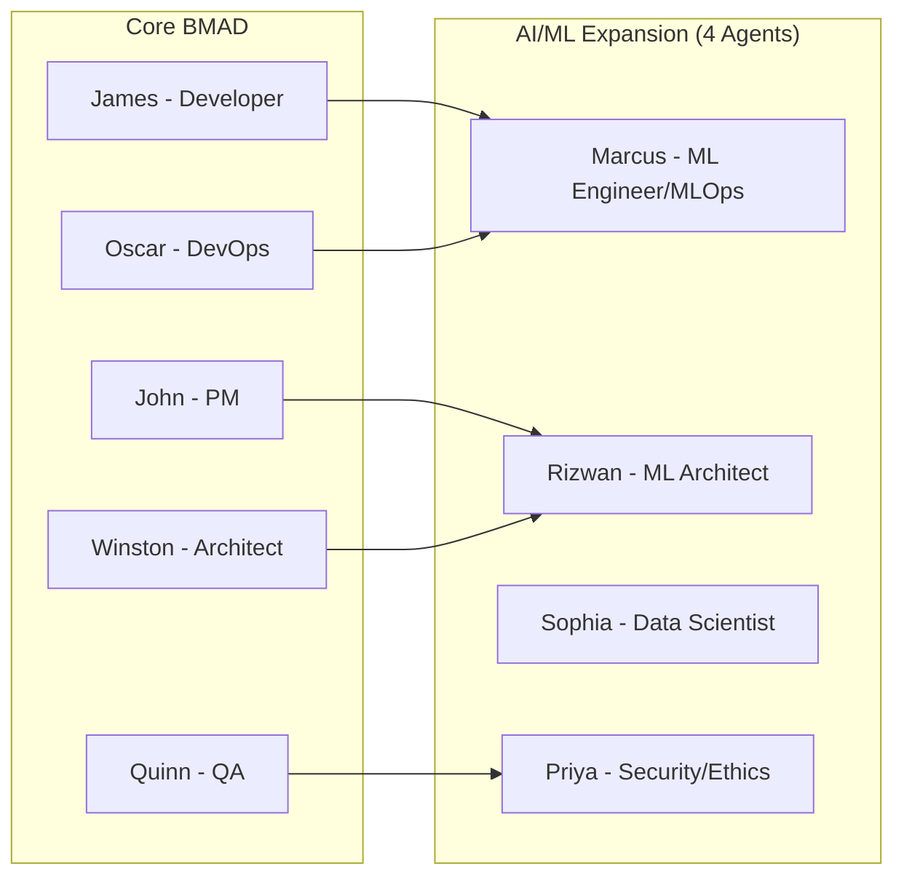

# BMAD AI/ML Engineering Integration Guide

## Overview

This guide explains how to integrate the BMAD AI/ML Engineering expansion pack with core BMAD and other systems. It covers technical integration, workflow coordination, and best practices for seamless operation.

## Architecture Principle: Extension, Not Duplication

The AI/ML expansion pack **extends** core BMAD capabilities rather than replacing them. This means:
- ✅ References core agents and utilities
- ✅ Enhances existing workflows with ML-specific steps
- ✅ Adds specialized agents for ML tasks
- ❌ Does NOT duplicate core functionality
- ❌ Does NOT create a separate framework

## Table of Contents

1. [Core BMAD Dependencies](#core-bmad-dependencies)
2. [Core BMAD Integration](#core-bmad-integration)
3. [Workflow Integration](#workflow-integration)
4. [Technical Integration](#technical-integration)
5. [Tool Integration](#tool-integration)
6. [Process Integration](#process-integration)
7. [Best Practices](#best-practices)

## Core BMAD Dependencies

### Required Core Components

The expansion pack depends on these core BMAD components:

#### Core Agents (Referenced, Not Duplicated)
- `bmad-core/agents/analyst.md` - Requirements analysis
- `bmad-core/agents/pm.md` - Project management
- `bmad-core/agents/po.md` - Product ownership
- `bmad-core/agents/sm.md` - Scrum management
- `bmad-core/agents/qa.md` - Quality assurance
- `bmad-core/agents/architect.md` - Extended by architect-enhanced
- `bmad-core/agents/dev.md` - Extended by dev-enhanced

#### Shared Resources
- `bmad-core/data/bmad-kb.md` - Core knowledge base
- `bmad-core/utils/template-format.md` - Template standards
- `bmad-core/utils/workflow-management.md` - Workflow orchestration
- `bmad-core/tasks/create-doc.md` - Document creation
- `bmad-core/tasks/execute-checklist.md` - Checklist execution
- `bmad-core/checklists/story-dod-checklist.md` - Base DoD (extended by ML version)

### Streamlined AI/ML Agents

Four specialized agents handle all AI/ML capabilities:
- **ml-engineer** (Marcus Tan Wei Ming) - ML development + MLOps implementation
- **ml-architect** (Rizwan bin Abdullah) - ML system architecture + design
- **ml-data-scientist** (Sophia D'Cruz) - Data analysis + experimentation
- **ml-security-ethics-specialist** (Priya Sharma) - Security + ethics + compliance

## Core BMAD Integration

### Agent Collaboration Map

The AI/ML agents work seamlessly with core BMAD agents through defined handoff points:



### Handoff Points

#### 1. Requirements → Architecture

**From: John (PM) → To: Rizwan (ML Architect)**

```yaml
handoff:
  trigger: "Requirements document completed"
  from:
    agent: john-pm
    deliverable: requirements.md
  to:
    agent: rizwan-ml-architect
    action: design-ml-architecture
  data_passed:
    - business_objectives
    - success_metrics
    - constraints
    - timeline
```

#### 2. System Design → ML Design

**From: Winston (Architect) → To: Rizwan (ML Architect)**

```yaml
handoff:
  trigger: "System architecture defined"
  from:
    agent: winston-architect
    deliverable: system-architecture.md
  to:
    agent: rizwan-ml-architect
    action: integrate-ml-components
  coordination:
    - API contracts
    - Data flow design
    - Service boundaries
    - Security requirements
```

#### 3. Development → ML Implementation

**From: James (Developer) → To: Marcus (ML Engineer)**

```yaml
handoff:
  trigger: "Backend services ready"
  from:
    agent: james-developer
    deliverable: api-implementation.md
  to:
    agent: marcus-ml-engineer
    action: integrate-model-serving
  integration:
    - API endpoints
    - Data pipelines
    - Authentication
    - Error handling
```

#### 4. Testing → Security Validation

**From: Quinn (QA) → To: Priya (Security/Ethics Specialist)**

```yaml
handoff:
  trigger: "Functional testing complete"
  from:
    agent: quinn-qa
    deliverable: test-results.md
  to:
    agent: priya-security-ethics
    action: security-ethics-assessment
  additional_testing:
    - Adversarial testing
    - Model robustness
    - Bias detection
    - Privacy compliance
```

#### 5. Infrastructure → MLOps

**From: Oscar (DevOps) → To: Marcus (ML Engineer/MLOps)**

```yaml
handoff:
  trigger: "Base infrastructure deployed"
  from:
    agent: oscar-devops
    deliverable: infrastructure.yaml
  to:
    agent: marcus-ml-engineer
    action: setup-ml-infrastructure
  ml_specific:
    - Model registry
    - Feature store
    - Experiment tracking
    - ML monitoring
```

## Workflow Integration

### Combined Workflow Example: Full-Stack AI Application

```yaml
workflow: full_stack_ai_application
duration: 6_months
phases:
  
  phase_1_discovery:
    week: 1-4
    core_bmad:
      - john: requirements gathering
      - winston: system architecture
    ai_ml:
      - rizwan: ml architecture
      - sophia: data assessment
      - priya: ethics review
    
  phase_2_development:
    week: 5-12
    core_bmad:
      - james: backend development
      - david: frontend development
    ai_ml:
      - marcus: model development
      - sophia: feature engineering
      - marcus: ml api implementation
    
  phase_3_integration:
    week: 13-18
    core_bmad:
      - winston: integration architecture
      - oscar: infrastructure setup
    ai_ml:
      - rizwan: ml integration
      - marcus: mlops pipeline
      - marcus: model optimization
    
  phase_4_deployment:
    week: 19-22
    core_bmad:
      - oscar: deployment automation
      - quinn: system testing
    ai_ml:
      - marcus: model deployment
      - priya: security testing
      - priya: final ethics review
    
  phase_5_launch:
    week: 23-24
    core_bmad:
      - john: stakeholder communication
      - oscar: production support
    ai_ml:
      - marcus: ml monitoring
      - all: knowledge transfer
```

### Parallel Work Streams

Enable parallel execution for efficiency:

```yaml
parallel_streams:
  stream_1_infrastructure:
    agents: [oscar, marcus]
    tasks:
      - Setup cloud infrastructure
      - Configure ML platform
      - Establish monitoring
    
  stream_2_development:
    agents: [james, marcus, sophia]
    tasks:
      - Build APIs
      - Develop models
      - Create interfaces
    
  stream_3_data:
    agents: [sophia, rizwan]
    tasks:
      - Data pipeline
      - Feature engineering
      - Data quality
    
  sync_points:
    - week_4: Architecture review
    - week_8: Integration testing
    - week_12: System validation
```

## Technical Integration

### API Integration Pattern

```python
# Core BMAD API
class CoreBMADAPI:
    def __init__(self):
        self.base_url = "https://api.bmad.core"
    
    def get_requirements(self, project_id):
        """Get requirements from PM"""
        return self.get(f"/projects/{project_id}/requirements")
    
    def get_architecture(self, project_id):
        """Get system architecture"""
        return self.get(f"/projects/{project_id}/architecture")

# AI/ML Extension API
class AIMLExtensionAPI:
    def __init__(self):
        self.base_url = "https://api.bmad.aiml"
        self.core_api = CoreBMADAPI()
    
    def create_ml_architecture(self, project_id):
        """Create ML architecture based on requirements"""
        requirements = self.core_api.get_requirements(project_id)
        system_arch = self.core_api.get_architecture(project_id)
        
        ml_architecture = {
            "base_architecture": system_arch,
            "ml_components": self.design_ml_components(requirements),
            "integration_points": self.identify_integration_points(system_arch),
            "data_flow": self.design_data_flow(requirements)
        }
        
        return self.post(f"/projects/{project_id}/ml-architecture", ml_architecture)
```

### Data Flow Integration

```yaml
data_flow:
  sources:
    - name: application_database
      owner: core_bmad
      access: read_only
    
    - name: user_events
      owner: core_bmad
      access: streaming
    
    - name: external_data
      owner: ai_ml
      access: full
  
  pipelines:
    - name: feature_pipeline
      owner: sophia_data_scientist
      inputs: [application_database, user_events]
      outputs: [feature_store]
      schedule: hourly
    
    - name: training_pipeline
      owner: marcus_ml_engineer
      inputs: [feature_store]
      outputs: [model_registry]
      schedule: daily
    
    - name: inference_pipeline
      owner: marcus_ml_engineer
      inputs: [feature_store, model_registry]
      outputs: [application_api]
      type: real_time
```

### Service Mesh Integration

```yaml
services:
  core_services:
    - name: user-service
      owner: core-bmad
      port: 8080
    
    - name: product-service
      owner: core-bmad
      port: 8081
  
  ml_services:
    - name: prediction-service
      owner: ai-ml
      port: 9090
      dependencies: [user-service, product-service]
    
    - name: feature-service
      owner: ai-ml
      port: 9091
      dependencies: [product-service]
    
    - name: model-service
      owner: ai-ml
      port: 9092
      dependencies: [feature-service]
  
  communication:
    protocol: grpc
    service_mesh: istio
    authentication: mutual_tls
    authorization: rbac
```

## Tool Integration

### Development Tools

```yaml
integrated_tools:
  version_control:
    core: github.com/org/bmad-core
    ai_ml: github.com/org/bmad-ai-ml
    integration: submodules
  
  ci_cd:
    core: jenkins
    ai_ml: github_actions
    integration: webhook_triggers
  
  monitoring:
    core: datadog
    ai_ml: mlflow + prometheus
    integration: unified_dashboards
  
  documentation:
    core: confluence
    ai_ml: mkdocs
    integration: cross_linking
```

### ML Platform Integration

```python
# Integration with existing ML platforms
class MLPlatformIntegration:
    def __init__(self, platform_type):
        self.platform = self._initialize_platform(platform_type)
    
    def _initialize_platform(self, platform_type):
        platforms = {
            'sagemaker': AWSMSageMakerIntegration(),
            'vertex': GCPVertexIntegration(),
            'azure_ml': AzureMLIntegration(),
            'databricks': DatabricksIntegration(),
            'kubeflow': KubeflowIntegration()
        }
        return platforms.get(platform_type)
    
    def deploy_model(self, model, config):
        """Deploy model to platform"""
        # Convert BMAD model format to platform format
        platform_model = self.convert_model_format(model)
        
        # Apply BMAD deployment standards
        deployment_config = self.apply_bmad_standards(config)
        
        # Deploy with platform-specific API
        return self.platform.deploy(platform_model, deployment_config)
```

### Monitoring Integration

```yaml
monitoring_integration:
  metrics:
    core_metrics:
      - request_rate
      - error_rate
      - latency
      - availability
    
    ml_metrics:
      - prediction_latency
      - model_accuracy
      - data_drift
      - feature_drift
      - prediction_drift
    
    business_metrics:
      - conversion_rate
      - revenue_impact
      - user_satisfaction
      - cost_per_prediction
  
  dashboards:
    unified_dashboard:
      panels:
        - core_system_health
        - ml_model_performance
        - business_kpis
        - cost_analysis
    
    ml_specific_dashboard:
      panels:
        - model_comparison
        - experiment_tracking
        - feature_importance
        - bias_monitoring
```

## Process Integration

### Agile Integration

```yaml
agile_process:
  sprint_planning:
    participants:
      core: [john_pm, winston_arch, james_dev]
      ai_ml: [rizwan_arch, marcus_ml, sophia_data, priya_security]
    
    activities:
      - Review combined backlog
      - Identify dependencies
      - Plan parallel work
      - Set integration points
  
  daily_standup:
    format: combined
    duration: 15_minutes
    focus:
      - Blockers between teams
      - Integration progress
      - Coordination needs
  
  sprint_review:
    demonstrations:
      - Core features
      - ML capabilities
      - Integrated functionality
    
    stakeholders:
      - Product owners
      - Technical leads
      - Data scientists
      - Business users
```

### Documentation Standards

```markdown
# Integrated Documentation Structure

/docs
  /core-bmad
    - architecture.md
    - api-reference.md
    - deployment.md
  
  /ai-ml
    - ml-architecture.md
    - model-documentation.md
    - mlops-guide.md
  
  /integration
    - integration-guide.md (this file)
    - api-contracts.md
    - data-flow.md
    - handoff-procedures.md
  
  /shared
    - glossary.md
    - standards.md
    - best-practices.md
```

### Change Management

```yaml
change_management:
  model_updates:
    process:
      1. Impact assessment
      2. Stakeholder notification
      3. Testing in staging
      4. Gradual rollout
      5. Monitoring
      6. Rollback if needed
    
    approvals:
      - Technical: ml_engineer + architect
      - Business: product_owner
      - Security: security_team
      - Ethics: ethics_officer
  
  api_changes:
    coordination:
      - Version deprecation notice
      - Migration guide
      - Backward compatibility
      - Client update support
```

## Best Practices

### 1. Communication

```yaml
communication_best_practices:
  channels:
    - Shared Slack workspace
    - Combined standups
    - Joint planning sessions
    - Cross-team reviews
  
  documentation:
    - Shared wiki
    - API contracts
    - Integration guides
    - Runbooks
  
  knowledge_sharing:
    - Tech talks
    - Pair programming
    - Code reviews
    - Workshops
```

### 2. Testing Strategy

```python
class IntegratedTestingStrategy:
    def test_end_to_end(self):
        """Test complete flow from UI to ML model"""
        # 1. User interaction
        response = self.ui_client.submit_request(test_data)
        
        # 2. Core API processing
        api_response = self.core_api.process(response)
        
        # 3. ML prediction
        prediction = self.ml_api.predict(api_response)
        
        # 4. Response formatting
        final_response = self.core_api.format_response(prediction)
        
        # 5. Validate entire chain
        assert self.validate_response(final_response)
    
    def test_integration_points(self):
        """Test each integration point"""
        integration_points = [
            'core_to_ml_api',
            'ml_to_database',
            'feature_store_access',
            'model_registry_access',
            'monitoring_pipeline'
        ]
        
        for point in integration_points:
            assert self.test_integration_point(point)
```

### 3. Performance Optimization

```yaml
performance_optimization:
  caching:
    - Feature caching for repeated predictions
    - Model caching in memory
    - API response caching
  
  batching:
    - Batch predictions for efficiency
    - Bulk data processing
    - Aggregated monitoring
  
  async_processing:
    - Non-blocking API calls
    - Message queue for heavy processing
    - Parallel model inference
```

### 4. Security Integration

```yaml
security_integration:
  authentication:
    method: oauth2
    provider: shared_identity_provider
    token_validation: centralized
  
  authorization:
    model: rbac
    policies:
      - core_users: read_predictions
      - ml_engineers: manage_models
      - data_scientists: access_experiments
  
  data_security:
    encryption:
      - at_rest: aes256
      - in_transit: tls1.3
    
    privacy:
      - pii_masking: enabled
      - audit_logging: comprehensive
      - data_retention: policy_based
```

### 5. Monitoring & Observability

```yaml
observability_strategy:
  tracing:
    tool: jaeger
    coverage:
      - API calls
      - Model inference
      - Data pipeline
      - Feature computation
  
  logging:
    format: structured_json
    aggregation: elasticsearch
    retention: 30_days
  
  metrics:
    collection: prometheus
    visualization: grafana
    alerting: pagerduty
  
  ml_specific:
    - Model performance tracking
    - Data drift detection
    - Feature importance monitoring
    - Bias detection alerts
```

## Integration Checklist

Before going to production, ensure:

### Technical Integration
- [ ] APIs are properly integrated
- [ ] Data flows are established
- [ ] Services communicate correctly
- [ ] Authentication/authorization works
- [ ] Monitoring is unified

### Process Integration
- [ ] Teams are coordinating
- [ ] Handoffs are smooth
- [ ] Documentation is complete
- [ ] Testing is comprehensive
- [ ] Deployment is automated

### Operational Integration
- [ ] Support procedures defined
- [ ] Escalation paths clear
- [ ] Monitoring dashboards ready
- [ ] Runbooks available
- [ ] Team training complete

## Troubleshooting

### Common Integration Issues

#### Issue 1: API Version Mismatch
```
Problem: Core API v2 incompatible with ML API v1
Solution: Use API versioning and maintain compatibility matrix
```

#### Issue 2: Data Schema Changes
```
Problem: Core database schema changed, breaking ML pipeline
Solution: Implement schema registry and validation
```

#### Issue 3: Performance Degradation
```
Problem: ML predictions slowing down core application
Solution: Implement async processing and caching
```

#### Issue 4: Security Token Expiration
```
Problem: ML services losing access to core services
Solution: Implement token refresh mechanism
```

## Support

For integration support:

1. **Documentation**: Check integration guide first
2. **Slack Channel**: #bmad-integration
3. **Office Hours**: Wednesdays 2-3 PM
4. **Email**: bmad-integration@aisingapore.org
5. **GitHub**: github.com/aisingapore/bmad-integration/issues

---

## Appendix: Integration Templates

### A. Handoff Template
```yaml
handoff_template:
  id: [unique_id]
  from_agent: [agent_name]
  to_agent: [agent_name]
  trigger: [condition]
  deliverables: [list]
  acceptance_criteria: [list]
  timeline: [duration]
```

### B. Integration Test Template
```python
def test_integration_[name]():
    # Setup
    # Execute
    # Validate
    # Cleanup
    pass
```

### C. Monitoring Alert Template
```yaml
alert_template:
  name: [alert_name]
  condition: [metric_condition]
  threshold: [value]
  duration: [time_window]
  severity: [low|medium|high|critical]
  notification: [channels]
  runbook: [link]
```

---

**Integration Complete!**

The BMAD AI/ML Engineering expansion pack is now fully integrated with core BMAD, ready for production use!