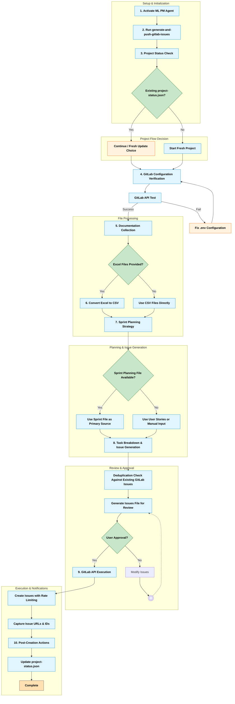

# Sprint Planning with ML PM Agent

## Overview

This document provides comprehensive guidance on using the ML PM agent (`agents/ml-pm.md`) for sprint planning and GitLab issue generation in AI/ML projects. The ML PM agent (Nicholas) specializes in sprint-level planning and execution for 100E (6-month) and SIP (3-4 month) projects.

## ML PM Agent Capabilities

### Agent Information
- **Name**: Nicholas  
- **Role**: AI/ML Sprint Project Manager & Delivery Strategist
- **Focus**: Sprint planning, user story management, AI/ML project timelines, deliverable tracking
- **Project Types**: 100E (6-month) and SIP (3-4 month) projects

### Core Principles
- Sprint-Centric Planning - Focus on sprint-level deliverables and timelines
- User Story Integration - Incorporate both AISG team and client user stories
- AI/ML Timeline Awareness - Understand typical AI/ML development phases

## Available Commands

| Commands | Capabilities | Requirements | Dependencies |
|----------|-------------|--------------|-------------|
| `*help` | Show available commands and capabilities | None | None |
| `generate-and-push-gitlab-issues` | Generate GitLab issues for sprint execution (1-3 day tasks for apprentices) | `.env` file with GitLab credentials<br/>User stories/product backlog documentation<br/>Sprint planning documentation | `tasks/generate-and-push-gitlab-issues.md`<br/>`templates/gitlab-issues-tmpl.yaml`<br/>`templates/project-status.yaml` |
| `exit` | Exit the PM agent (requires confirmation) | None | None |

## Sprint Planning Workflow

### Prerequisites Setup

Before starting sprint planning, ensure you have:

1. **GitLab Configuration** (`.env` file):
   ```bash
   GITLAB_URL="https://gitlab.com"  # or your GitLab instance
   GITLAB_TOKEN="your-personal-access-token"
   PROJECT_ID="your-project-id"
   ```

2. **Documentation Files**:
   - Product backlog file (User Stories) - CSV or Excel format
   - Sprint planning file (Sprint tasks) - CSV or Excel format

### Workflow Diagram



### Step-by-Step Process

#### 1. Activate ML PM Agent
```bash
# Load the ML PM agent
/bmad-aisg-aiml/agents/ml-pm.md
# The agent will greet you and mention the *help command
```

#### 2. Generate GitLab Issues
```bash
*generate-and-push-gitlab-issues
```

#### 3. Project Status Check
- Checks for existing `docs/project-status.json`
- Allows choice between:
  - Continue with existing project context
  - Start fresh sprint planning 
  - Update existing sprint

#### 4. GitLab Configuration Verification
- Tests GitLab API connectivity
- Verifies project access and permissions
- Displays project information for confirmation

#### 5. Documentation Collection
- Requests user stories file (Product Backlog)
- Requests sprint planning file 
- Supports both CSV and Excel file formats
- Automatically converts Excel files to CSV using LibreOffice or pandas

#### 6. File Format Processing
If you provide Excel files (.xlsx, .xls), the agent will:
- Create `docs/converted/` directory
- Convert Excel files to CSV format
- Use LibreOffice (preferred) or Python pandas for conversion
- Update file paths to use converted CSV files

#### 7. Sprint Planning Strategy
**If Sprint Planning File is PROVIDED**:
- Uses sprint planning file as primary source for issue generation
- Extracts task breakdowns, assignments, and priorities
- Supplements with user stories for additional context

**If Sprint Planning File is NOT PROVIDED**:
- Offers to generate issues based on user stories file
- Provides manual sprint planning input collection as fallback

#### 8. Task Breakdown and Issue Generation
- Breaks down requirements into 1-3 day tasks
- Performs comprehensive user story coverage check
- Generates GitLab-ready JSON format
- Includes deduplication against existing GitLab issues
- Creates verification file for user review

#### 9. GitLab API Execution
- Uses verified issues file for API calls
- Implements rate limiting and error handling
- Provides real-time progress updates
- Captures created issue URLs and IDs

#### 10. Post-Creation Actions
- Updates `docs/project-status.json` for tracking
- Generates comprehensive execution summary
- Creates team notification templates
- Documents sprint board organization

## Documentation Templates

### Product Backlog Template (CSV)
```csv
S/N,Type of User,Perform Some Task,Achieve Some Goal,Component,Date Created,Created By,Status,Priority,Remarks
```

### Sprint Planning Template (CSV)
```csv
S/N,Task,Short Description/Details,Days,Priority,Remarks
```

## File Structure and Outputs

### Generated Files Location
All generated files are saved in the `docs/` folder:
- `docs/gitlab-issues-generated.json` - Issues for GitLab API execution
- `docs/project-status.json` - Project tracking and status
- `docs/converted/` - Converted CSV files from Excel inputs

### Issue Structure
The agent generates two types of GitLab issues:

#### User Story Issues
```json
{
  "title": "[User Story <S/N>] As a <Type of User>, I want to <Perform Some Task>, so that <Achieve Some Goal>",
  "description": "## User Story Details\n**As a:** <Type of User>\n**I want to:** <Perform Some Task>\n**So that:** <Achieve Some Goal>\n\n## Acceptance Criteria\n- [ ] [Criterion 1]",
  "labels": ["user-story", "component::<Component>", "priority::<Priority>"],
  "assignee_id": [user-id],
  "milestone_id": [milestone-id],
  "weight": [1-3]
}
```

#### Sprint Task Issues  
```json
{
  "title": "[Component] - [Brief Task Description]",
  "description": "## Context\n[Background]\n\n## Requirements\n[Details]\n\n## Definition of Done\n- [ ] [DoD 1]\n- [ ] [DoD 2]",
  "labels": ["component::[component]", "effort::[days]", "priority::[priority]"],
  "assignee_id": [user-id],
  "milestone_id": [milestone-id],
  "weight": [1-3]
}
```

## Component Categories

Issues are organized by component:
- **EDA**: Exploratory Data Analysis
- **Data**: Data processing and management
- **Model**: Machine learning model development
- **Others**: General tasks
- **Documentation**: Documentation and reporting
- **Integration**: System integration tasks
- **Lit Review**: Literature review tasks
- **Deployment**: Deployment and production
- **Pipeline**: ML pipeline development
- **Testing**: Testing and validation
- **Feature**: Feature engineering

## Best Practices

### Documentation Preparation
1. **Use Structured Formats**: Provide CSV or Excel files with proper headers
2. **Complete User Stories**: Include all required fields (S/N, Type of User, Task, Goal, Component, etc.)
3. **Detailed Sprint Tasks**: Specify effort estimates, priorities, and descriptions
4. **Consistent Naming**: Use consistent component and priority naming

### Sprint Planning
1. **Review Existing Issues**: Agent automatically checks for duplicates
2. **Verify Team Assignments**: Confirm apprentice GitLab user IDs
3. **Validate Effort Estimates**: Ensure tasks are 1-3 days in scope
4. **Confirm Sprint Goals**: Align issues with overall sprint objectives

### Issue Management
1. **Milestone Organization**: Issues organized by sprint milestones only
2. **No Sprint Labels**: Avoid "sprint::3" type labels - use milestones instead
3. **Component Labeling**: Use component:: prefix for categorization
4. **Priority Assignment**: Use priority:: labels for task prioritization

## Error Handling and Troubleshooting

### Common Issues

#### GitLab API Errors
- **Invalid Token**: Check token permissions (api, read_user, write_repository scopes)
- **Project Access**: Verify PROJECT_ID and user permissions
- **Rate Limiting**: Agent implements automatic delays between requests

#### File Processing Errors
- **Excel Conversion**: Requires LibreOffice or Python pandas
- **File Format**: Ensure proper CSV structure with required headers
- **File Paths**: Provide absolute paths to documentation files

#### Issue Creation Failures
- **Duplicate Titles**: Agent performs deduplication checks
- **Invalid Assignees**: Verify GitLab user IDs exist and have project access
- **Missing Milestones**: Create sprint milestone in GitLab before execution

### Recovery Actions
1. **Check `.env` Configuration**: Verify all required environment variables
2. **Test API Connectivity**: Use provided test command for verification
3. **Review Generated Files**: Inspect `docs/gitlab-issues-generated.json` before execution
4. **Monitor Execution Progress**: Watch for API response errors during creation

## Integration with Project Management

### Project Status Tracking
The `docs/project-status.json` file enables:
- PM agent status monitoring
- Cross-sprint progress tracking  
- Team assignment visibility
- Issue lifecycle management

### Sprint Board Management
- Issues organized by GitLab milestones
- Automatic component-based categorization
- Team assignment distribution
- Progress tracking and reporting

### Team Coordination
- Automated team notification generation
- Clear assignment communication
- Sprint goal alignment
- Development environment setup guidance

## Advanced Features

### Multi-Project Support
The agent supports two distinct project types (handles one type per project, not a mixture):
- **100E Projects**: 6-month duration projects with extended sprint planning
- **SIP Projects**: 3-4 month duration projects with condensed sprint cycles
- **Adaptive Timeline Management**: Adjusts planning approach based on selected project type

### Cross-Team Coordination
- AISG team user story integration
- Client user story management
- Stakeholder alignment tracking

This documentation enables effective use of the ML PM agent for comprehensive sprint planning and GitLab issue management in AI/ML projects.